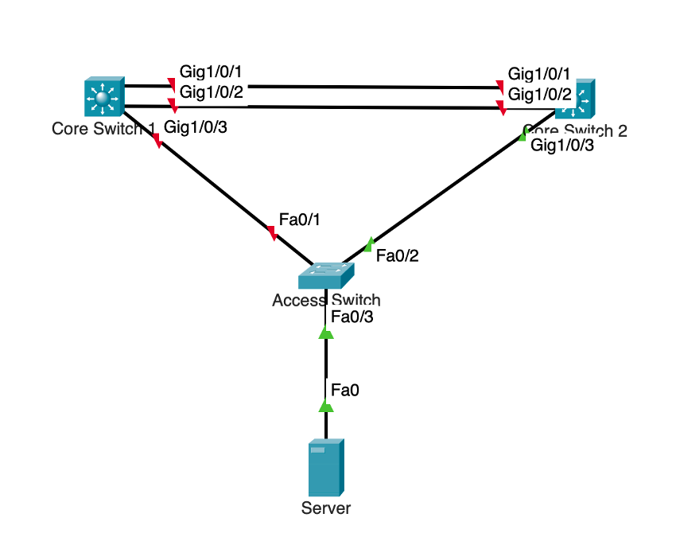
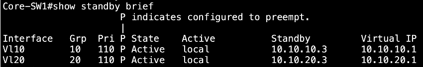
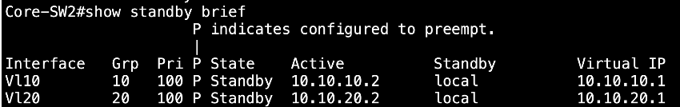
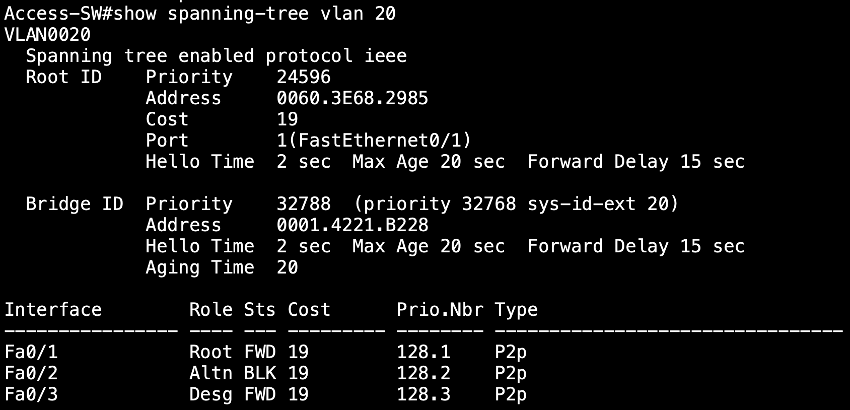
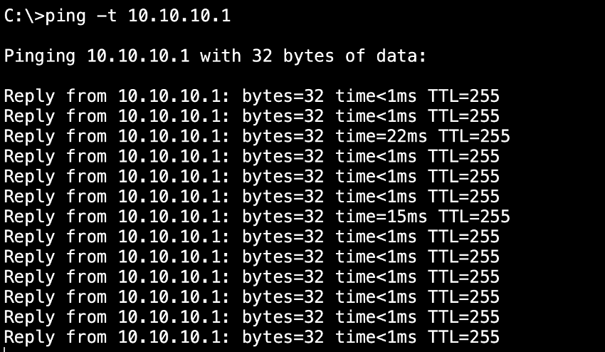

  
  
  
  

# Design & Implementation of a High Availability (HA) Core Network Infrastructure

## 1. Executive Summary & Business Context

In any modern enterprise, network downtime is not just an inconvenience; it translates directly to lost revenue, decreased productivity, and potential reputational damage. A flat network with single points of failure is a high-risk architecture. For institutions like hospitals, financial firms, and e-commerce platforms, network availability is mission-critical.

This project addresses this challenge by designing, implementing, and validating a highly available core network infrastructure within the Cisco Packet Tracer simulation environment. The architecture is a scaled-down model of industry best practices, focused on building a resilient, self-healing network that can automatically withstand common device and link failures with minimal to no impact on end-users.

**The lab file can be downloaded and explored in Cisco Packet Tracer: [High-Availability-Lab.pkt](./lab-file/high-availability-lab.pkt).**

---

## 2. Project Objectives & Demonstrated Skills

This lab provides a practical demonstration of a robust, fault-tolerant network design by focusing on four key pillars of High Availability:

-   **Device Redundancy (Hardware Failover):** Deployed a dual Core Switch architecture to eliminate the core switch as a single point of failure.
-   **Gateway Redundancy (First-Hop Failover):** Implemented the **Hot Standby Router Protocol (HSRP)** to provide a resilient, virtual default gateway for end devices.
-   **Link Redundancy & Loop Prevention (Path Failover):** Established redundant physical links between network layers and utilized **Spanning Tree Protocol (STP)** to maintain a loop-free topology that can intelligently re-route traffic.
-   **Bandwidth Aggregation & Redundancy (Link Failover):** Implemented an **EtherChannel** link between the two Core Switches to aggregate bandwidth and provide link-level fault tolerance.

---

## 3. Network Architecture & Design

The network is built on a two-tier hierarchical model (Core and Access) and designed for complete redundancy.

_**Figure 1:** The dual-core network topology designed for High Availability._

### Technology & Component Stack

| Role                 | Device Model            | Key Function                                                       |
| -------------------- | ----------------------- | ------------------------------------------------------------------ |
| **Core Layer Switch 1**  | Cisco 3650 Layer 3 Switch | Primary L3 router, Active HSRP router, Primary STP Root Bridge.  |
| **Core Layer Switch 2**  | Cisco 3650 Layer 3 Switch | Secondary L3 router, Standby HSRP router, Secondary STP Root.    |
| **Access Layer Switch**| Cisco 2960 Layer 2 Switch | Provides end-device connectivity with redundant uplinks to the core. |
| **End Device**           | Server                  | Represents a typical user device requiring constant network access. |

### IP & VLAN Schema
The network is segmented to separate different traffic types, a security and management best practice. HSRP provides a consistent virtual gateway IP for each subnet, abstracting the physical router from the end device.

| VLAN ID | Name         | Subnet          | HSRP Virtual IP (Gateway) | Core-SW1 IP (Active) | Core-SW2 IP (Standby) |
|---------|--------------|-----------------|---------------------------|----------------------|-----------------------|
| 10      | MANAGEMENT   | `10.10.10.0/24` | `10.10.10.1`              | `10.10.10.2` (Prio 110)  | `10.10.10.3` (Prio 100)   |
| 20      | ACCESS       | `10.10.20.0/24` | `10.10.20.1`              | `10.10.20.2` (Prio 110)  | `10.10.20.3` (Prio 100)   |

---

## 4. Configuration & Steady-State Verification

In its normal, fully operational state, the network logic is controlled by HSRP and STP priorities.

### 4.1. HSRP Verification (Active/Standby Gateway)
`Core-SW1` was configured with a higher priority (`110`) to ensure it becomes the **Active** HSRP router, actively forwarding traffic. `Core-SW2` remains in a **Standby** state, ready to take over.

**Verification Command:** `show standby brief` on `Core-SW1`. The output confirms its "Active" state.

_**Figure 2:** HSRP status showing Core-SW1 as the Active router._

### 4.2. STP Verification (Loop-Free Topology)
`Core-SW1` was also configured as the **Root Bridge** for all VLANs. Consequently, the Access Switch intelligently forwards all traffic through its uplink to `Core-SW1` (`Gig0/1`) while placing the redundant uplink to `Core-SW2` (`Gig0/2`) in a **Blocking** state to prevent a network loop.

**Verification Command:** `show spanning-tree vlan 20` on `Access-SW`.

_**Figure 3:** STP status on the Access Switch showing the path to Core-SW2 is intentionally blocked._

---

## 5. Failure Simulation & High Availability Validation

**The true test of an HA network is not its steady-state operation, but its ability to recover from failure.**

A catastrophic failure of the primary switch (`Core-SW1`) was simulated by powering it down. A continuous ping was initiated from the Server to its gateway (`10.10.20.1`) to monitor the entire failover process in real-time.

-   **Test Command:** `ping 10.10.20.1 -t` from the Server's command prompt.
-   **Failure Action:** `Core-SW1` was powered off.

### Results: Autonomous Network Recovery
The network's redundancy protocols worked in concert to automatically restore service with minimal packet loss.

1.  **HSRP Failover:** Within seconds, `Core-SW2` detected the loss of HSRP hellos from `Core-SW1`. It immediately promoted itself from the Standby role to become the new **Active** gateway router.
2.  **STP Convergence:** Simultaneously, `Access-SW` detected that its root port to `Core-SW1` was down. It re-ran the STP algorithm and unblocked its port `Gig0/2` (the path to `Core-SW2`), transitioning it to a **Forwarding** state.
3.  **Connectivity Restored:** The continuous ping from the server resumed successfully after a brief interruption of only a few dropped packets. This confirms a near-seamless failover from the end-user's perspective.

_**Figure 4:** The ping test shows connectivity is restored automatically after a minimal outage, proving the HA design works._

---

## 6. Conclusion & Key Takeaways

This project successfully demonstrates the design and implementation of a robust, fault-tolerant network. The key takeaway is how different redundancy protocols, often taught separately, work together to create a truly resilient system.

-   **Synergy of Protocols:** This lab proves that HSRP handles gateway failure while STP handles link/path failure. Together, they ensure there is always a valid, loop-free path for traffic.
-   **Business Continuity:** I learned how network architecture directly supports business continuity, allowing for both unplanned outages and planned maintenance (e.g., upgrading a core switch) without impacting users.
-   **Practical CCNA Skills:** This project solidified my hands-on skills in configuring, verifying, and troubleshooting core CCNA concepts (L3 Switching, VLANs, HSRP, STP, EtherChannel) in a realistic scenario.
